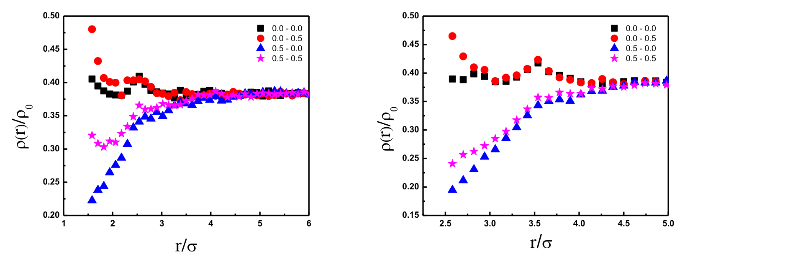
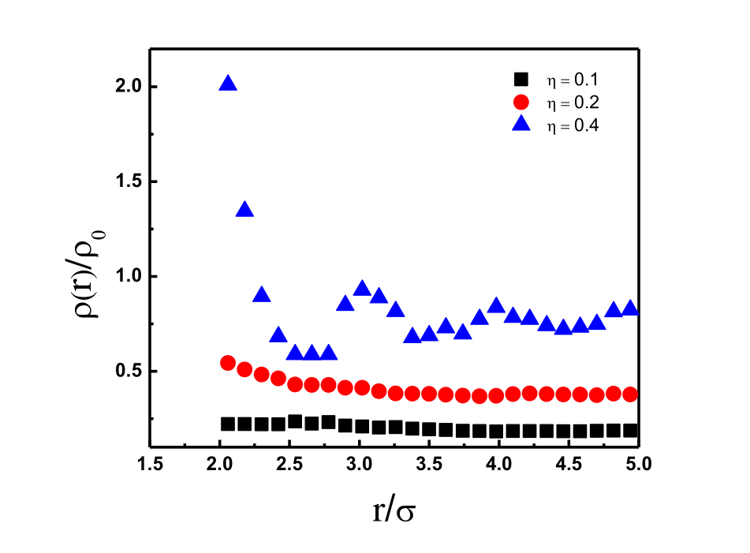

# MC-SimPolymerChains

Monte Carlo simulation of freely-jointed polymer chains around a central spherical
interface, in a periodic cubic box. The code measures how chains structure
themselves near the sphere — radial density profiles, chain dimensions, and
chain-shape metrics — as a function of chain length, sphere size, packing
fraction, and (optionally) attractive interactions.

The repository contains two things:

- **`polymc`** (the `src/` + `app/` fpm project) — a modern Fortran rewrite that
  is the maintained codebase.
- **`runt/` and `polyfj/`** — the original Fortran-77 programs, kept as a
  reference and validation baseline.

## Background

The model treats each polymer as a freely-jointed chain of hard beads (diameter
σ = 1). A single large sphere sits fixed at the centre of a periodic box.
Simulations run in the canonical (NVT) ensemble using three Monte Carlo moves —
local displacement (Dickman), reptation, and configurational-bias regrowth (CCB).
Two physical regimes are supported:

- **Athermal** — hard chains near a hard sphere (excluded volume only).
- **Thermal** — hard core plus Yukawa attractions, both bead–bead and
  bead–sphere, with Metropolis acceptance.

The physics of interest is the competition between packing and configurational
entropy near the interface, and how attractions shift the interfacial density.

## Selected results

The two figures below are from the original 2016 study (the normalized radial
density profile ρ(r)/ρ₀ vs distance r/σ from the sphere centre), and capture its
main conclusions.

**Effect of attractions** — the central result.



8-mers at packing fraction η = 0.2; left panel sphere radius σₛ = 1.5σ, right
panel 2σ. The legend is (ε_ff – ε_sf), chain–chain and sphere–chain attraction
strengths. Sphere–chain attraction alone (0.0–0.5, red) **raises** the density at
the interface; chain–chain attraction alone (0.5–0.0, blue) pulls chains toward
each other and **lowers** it; with both on (0.5–0.5, magenta) the chain–chain
effect dominates and the net interfacial density still drops relative to the
no-attraction case (0.0–0.0, black).

**Effect of packing fraction** — packing entropy dominates.



8-mers, sphere radius σₛ = 1.5σ, athermal. As the bulk packing fraction rises
(η = 0.1 → 0.2 → 0.4) the density just outside the sphere increases sharply,
showing that packing-entropy effects dominate over the configurational cost of
crowding chains near the interface.

## The two programs

| | Physics | Outputs |
|---|---|---|
| **`polyfj`** | Athermal: hard chains, hard central sphere | density profile (total / end / mid beads), radius-of-gyration & end-to-end profiles, segmental order parameter, chain-shape semi-axes |
| **`runt`** | Thermal: hard core + Yukawa (bead–bead and bead–sphere), Metropolis | radial density profile, average energy |

Both share the same move set and box conventions; `polyfj` is effectively the
athermal limit, and additionally computes the richer structural diagnostics.

## Modern rewrite (`polymc`)

The `src/` modules and `app/` drivers are a from-scratch modern-Fortran
reimplementation (an [fpm](https://fpm.fortran-lang.org/) project) of the two
programs over a shared, unit-tested library. Highlights:

- A real periodic cell list for neighbour search (the original declared one but
  never used it).
- A modern PRNG (xoshiro256\*\*) with deterministic, reproducible seeding.
- `implicit none`, derived types, and allocatable arrays throughout; no fixed
  size ceilings or `COMMON` blocks.
- Positions stored in real (σ) units rather than the original reduced units.
- 54 unit tests (cell-list-vs-brute-force, energy consistency, RNG, eigensolver,
  deck I/O round-trips, move invariants).

`runt`'s energy is the **exact** full Yukawa sum by default (faithful to the
original); a distance cutoff (cell-list accelerated) is available opt-in purely
for performance benchmarking. `polyfj`'s structural diagnostics use corrected,
unit-consistent formulas by default, with a `--legacy-obs` switch to reproduce
the original formulas for direct comparison.

## Layout

```
src/                 modern Fortran modules (polymc_*, runt_*, polyfj_*)
app/                 modern drivers (runt.f90, polyfj.f90)
test/                test-drive unit tests
tools/               compare_profiles.py (legacy-vs-modern density comparator)
fpm.toml, Makefile   build (fpm primary, make fallback)
docs/
  modern-build.md    build / test / run guide for the modern code
  validation.md      legacy-vs-modern regression runbook
runt/                legacy runt program + Python tooling + generated decks
  runt.f, runt-moves.f
  tools/setup_runs.py, run_all.sh, examples/, runs/
polyfj/              legacy polyfj program + Python tooling + generated decks
  polyfj.f, polyfj-moves.f
  tools/setup_runs.py, tools/plot_results.py, run_all.sh, examples/, runs/
```

The Python tooling (deck generation, run harness, plotting) and the input/output
file formats are shared between the legacy and modern code, so either engine can
drive the same cases.

## Quick start (modern code)

Requires `gfortran` and `fpm` (`brew install fpm`).

```bash
fpm build      # build the modern runt and polyfj
fpm test       # run the unit tests
make build     # gfortran-only fallback (no fpm)
```

Generate input decks and run a sweep (example: chain length × sphere size ×
packing fraction), then plot:

```bash
cd polyfj
python3 tools/setup_runs.py --n 4 8 16 --sphere 1.0 1.5 2.0 --eta 0.1 0.2 0.4
POLYMC_ENGINE=modern ./run_all.sh          # run with the modern binary
python3 tools/plot_results.py --observable density --vary sphere --fix n=8 --fix eta=0.2
```

`./run_all.sh` defaults to the legacy binary; set `POLYMC_ENGINE=modern` to use
the rewrite. The deck generators take arbitrary parameter lists — the conditions
from the original study are just one example (see `runt/examples/` and
`polyfj/examples/`). See `docs/modern-build.md` for the full guide, including
runt's exact-vs-cutoff energy modes.

## Validating the rewrite against the original

`docs/validation.md` gives copy-pasteable commands to run a deck through both the
legacy and modern builds and compare the density profiles with
`tools/compare_profiles.py` — a statistical, Monte-Carlo-error-aware check, since
the two use independent RNG streams. Exact-mode `runt` is expected to reproduce
the legacy density within sampling error.

## License

GPL v3 — see [LICENSE](LICENSE).
